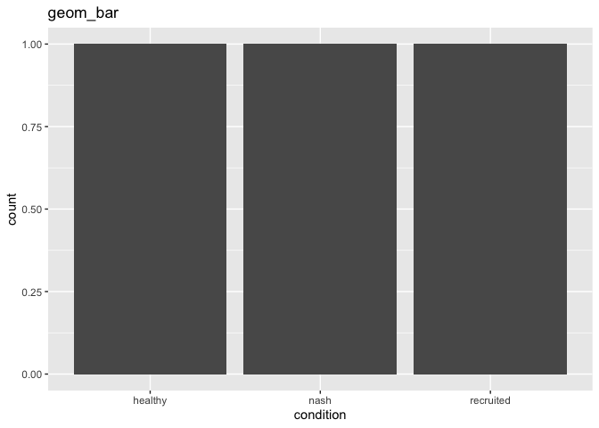
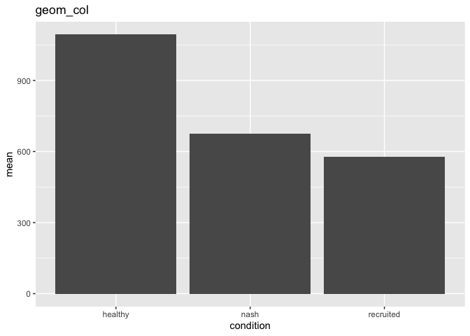
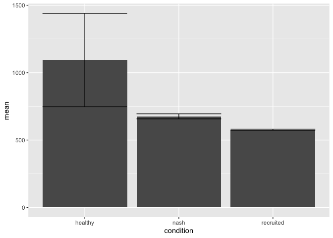
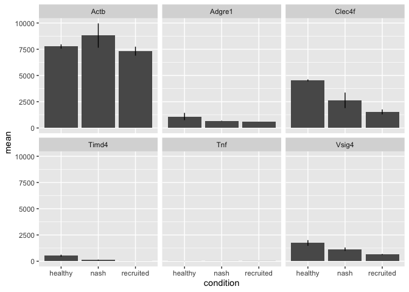
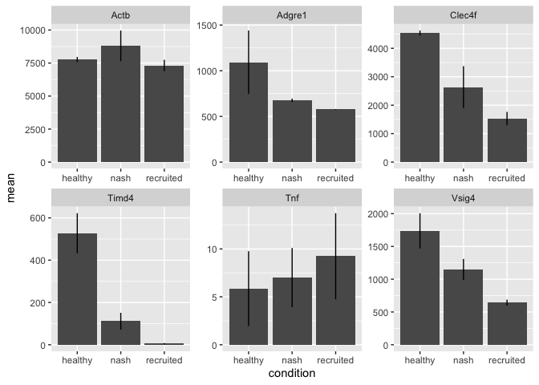
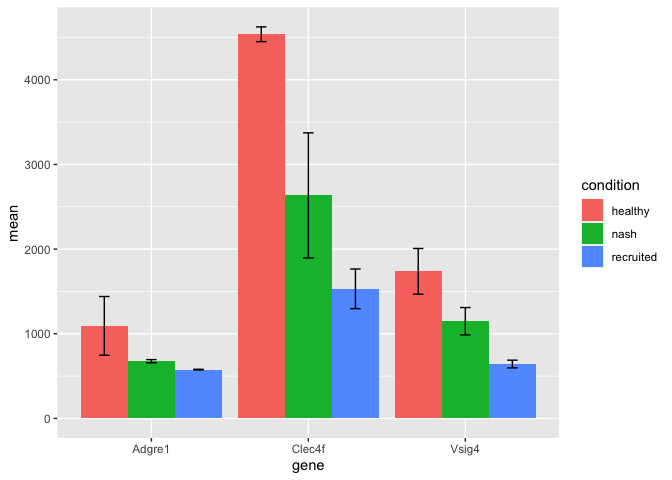
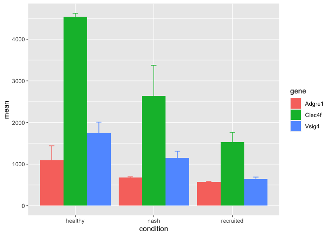
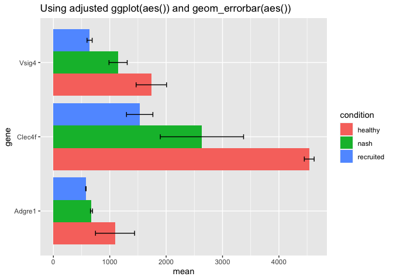
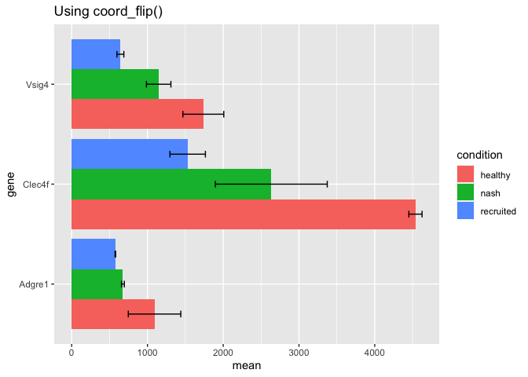
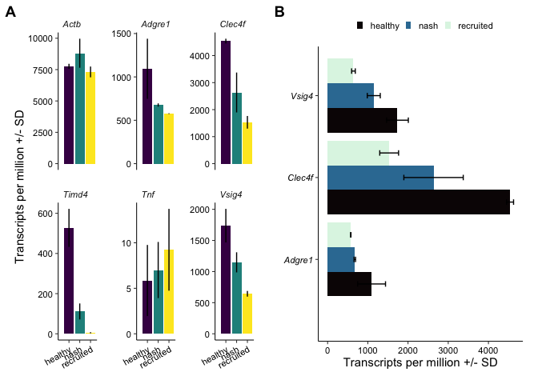

Making a bar chart using RNA-seq data
================

In this tutorial we will learn to make a bar chart using RNA-seq data
from table S2 in [Seidman et. al. Immunity. Volume 52, Issue 6, 16 June
2020, Pages 1057-1074.e7](https://pubmed.ncbi.nlm.nih.gov/32362324/),
which can be downloaded
[here](https://ars.els-cdn.com/content/image/1-s2.0-S107476132030159X-mmc3.xlsx).
Once we have the data, we will need to open Rstudio and load the
necessary packages. We can do that with
[library()](https://www.datacamp.com/community/tutorials/r-packages-guide).

``` r
lapply(
  X = c("cowplot", "dplyr", "ggplot2", "readr", "tidyr"),
  FUN = library,
  character.only = TRUE
)
```

In the prior tutorial, we spent time learning how to read in data, and
process it into a more friendly, or tidy, format. You can revisit that
information [here](Introduction-RNASeqAnalysis.md).

With the assumption that this information is fresh in our minds, lets
read in a subset of this data. We will select the first 8 columns, and
rename these columns to an easier to read format. We will also extract
the gene name from column 2 and discard all text after the first
occurrence of the ‘\|’ symbol using ‘separate.’ We will then discard
rows containing the same gene using ‘distinct.’ This occurs because the
initial expression table was generated using without the -condenseGenes
option using [HOMER
analyzeRepeats.pl](http://homer.ucsd.edu/homer/ngs/rnaseq/index.html).

``` r
# Note, when reading in your data, you should change the path to the
# location/name of your data
colnames(
  readxl::read_xlsx(path = "../Data/Source/1-s2.0-S107476132030159X-mmc3.xlsx")
) %>% head(8)
```

    [1] "Transcript/RepeatID (cmd=analyzeRepeats.pl rna mm10 -count exons -tpm -dfile Table_S2_dfile.txt)"
    [2] "Annotation/Divergence"                                                                           
    [3] "KCH_rep1_figure1,3,4"                                                                            
    [4] "KCH_rep2_figure1,3,4"                                                                            
    [5] "KCN_rep1_figure1,3,4"                                                                            
    [6] "KCN_rep2_figure1,3,4"                                                                            
    [7] "KN-RM_rep1_figure1,3,4"                                                                          
    [8] "KN-RM_rep2_figure1,3,4"                                                                          

``` r
tb1 <-
  readxl::read_xlsx(path = "../Data/Source/1-s2.0-S107476132030159X-mmc3.xlsx") %>%
  dplyr::select(1:8) %>%
  dplyr::rename(
    accession = 1,
    gene = 2,
    healthy_rep1 = 3,
    healthy_rep2 = 4,
    nash_rep1 = 5,
    nash_rep2 = 6,
    recruited_rep1 = 7,
    recruited_rep2 = 8
  ) %>%
  separate(col = 2, into = "gene", 
           sep = "\\|", # uses regular expression rules
           remove = TRUE, extra = "drop") %>%
  distinct(gene, .keep_all = TRUE)
tb1 %>% head() %>% knitr::kable() #knitr::kable can be used for displaying nicer tables
```

| accession    | gene     | healthy_rep1 | healthy_rep2 | nash_rep1 | nash_rep2 | recruited_rep1 | recruited_rep2 |
|:-------------|:---------|-------------:|-------------:|----------:|----------:|---------------:|---------------:|
| NM_001329047 | Mia2     |       43.600 |       36.309 |    29.644 |    26.789 |         31.999 |         38.089 |
| NM_172405    | Abraxas1 |        1.913 |        2.205 |     1.953 |     1.818 |          2.278 |          2.202 |
| NM_001359283 | Sec63    |       19.312 |       17.762 |    13.237 |    12.867 |         14.032 |         15.969 |
| NM_001168290 | Sugp2    |       11.500 |        8.864 |    10.921 |     7.571 |         12.740 |          9.618 |
| NM_001356498 | Mtmr12   |        7.145 |        8.743 |     6.711 |     6.839 |          7.881 |          7.009 |
| NM_001358950 | Cbx5     |        6.531 |        6.207 |     5.856 |     7.199 |          8.375 |          8.728 |

Making plots with ggplot2 requires data to be in a particular format.
Each column is a variable, each row should is an observation, and each
cell is a single value. Having data in this
[‘tidy’](https://tidyr.tidyverse.org/articles/tidy-data.html) format is
a common goal within the tidyverse. For example:

``` r
tibble(
  geneName = c("geneA", "geneA", "geneB", "geneB"),
  condition = c("untreated", "treated", "untreated", "treated"),
  expression = c(21, 23, 103, 109)
) %>% knitr::kable()
```

| geneName | condition | expression |
|:---------|:----------|-----------:|
| geneA    | untreated |         21 |
| geneA    | treated   |         23 |
| geneB    | untreated |        103 |
| geneB    | treated   |        109 |

For the purpose of a ggplot2 barplot, we can use dplyr::summarize to
calculate the associated statistics. In this case, we don’t want to
transform our data or pre-calculate the mean. But we do need to shift
the data into the ‘longer’ format as above. We can accomplish this using
[tidyr::pivot_longer](https://tidyr.tidyverse.org/reference/pivot_longer.html).
In this case, first define which columns should be pivoted using
**cols**, then define the variable name assigned to the values column
with **values_to**. Variable names for each condition and replicate are
generated by splitting on the ‘\_’ character integrated with the rename
function when reading in the data. This is done with **names_to** and
**names_sep**.

``` r
tb1 %>%
  pivot_longer(
    cols = -(1:2), # by using a `-`, we can exclude the first two columns
    values_to = c("tpm"),
    names_to = c("condition", "replicate"),
    names_sep  = "_"
  ) %>% head() %>% knitr::kable()
```

| accession    | gene | condition | replicate |    tpm |
|:-------------|:-----|:----------|:----------|-------:|
| NM_001329047 | Mia2 | healthy   | rep1      | 43.600 |
| NM_001329047 | Mia2 | healthy   | rep2      | 36.309 |
| NM_001329047 | Mia2 | nash      | rep1      | 29.644 |
| NM_001329047 | Mia2 | nash      | rep2      | 26.789 |
| NM_001329047 | Mia2 | recruited | rep1      | 31.999 |
| NM_001329047 | Mia2 | recruited | rep2      | 38.089 |

With the data in this longer format, we can now use a combination of
[dplyr::group_by](https://dplyr.tidyverse.org/reference/group_by.html)
and
[dplyr::summarise](https://dplyr.tidyverse.org/reference/summarise.html)
to calculate the plotting variable we desire for each gene:condition.

``` r
summary1 <-
  tb1 %>%
  pivot_longer(
    cols = -(1:2),
    values_to = c("tpm"),
    names_to = c("condition", "replicate"),
    names_sep  = "_"
  ) %>%
  group_by(gene, condition) %>%
  summarise(n = n(),
            mean = mean(tpm),
            sd = sd(tpm))
```

    `summarise()` has grouped output by 'gene'. You can override using the
    `.groups` argument.

``` r
summary1 %>% head() %>% knitr::kable()
```

| gene          | condition |   n |   mean |        sd |
|:--------------|:----------|----:|-------:|----------:|
| 0             | healthy   |   2 | 0.9915 | 1.4021927 |
| 0             | nash      |   2 | 2.5565 | 3.6154370 |
| 0             | recruited |   2 | 3.9465 | 0.1053589 |
| 0610005C13Rik | healthy   |   2 | 2.3495 | 0.7700393 |
| 0610005C13Rik | nash      |   2 | 1.1445 | 0.5536646 |
| 0610005C13Rik | recruited |   2 | 1.1375 | 0.6682159 |

Now the data is in a suitable tidy format. Ggplot has two options for
making [bar
charts](https://ggplot2.tidyverse.org/reference/geom_bar.html): geom_bar
and geom_col. Read more at the link above. Essentially, **use**
***geom_bar()*** **if the desired plot should be proportional to the
number of times an observation occurs**, and **use** ***geom_col()***
**if the plot should be proportional to the values in the data**.

``` r
summary1 %>%
  filter(gene == "Adgre1") %>%
  ggplot(aes(x = condition)) +
  geom_bar() +
  ggtitle("geom_bar")

summary1 %>%
  filter(gene == "Adgre1") %>%
  ggplot(aes(x = condition, y = mean)) +
  geom_col(position = position_dodge()) +
  ggtitle("geom_col")
```





We can also add an error bar to the geom_col() using [geom_errorbar() or
geom_linerange()](https://ggplot2.tidyverse.org/reference/geom_linerange.html).
Layering the error interval onto the bar charts requires defining
aesthetic mappings with aes().

``` r
summary1 %>%
  filter(gene == "Adgre1") %>%
  ggplot(aes(x = condition, y = mean)) +
  geom_col() +
  geom_errorbar(aes(
    x = condition,
    ymin = mean - sd,
    ymax = mean + sd
  ))

summary1 %>%
  filter(gene == "Adgre1") %>%
  ggplot(aes(x = condition, y = mean)) +
  geom_col() +
  geom_linerange(aes(
    x = condition,
    ymin = mean - sd,
    ymax = mean + sd
  ))
```




Often it will be desired to create a panel of bar charts for several
genes of interest. This is quite easy to accomplish with ggplot by
adding
[facet_wrap](https://ggplot2.tidyverse.org/reference/facet_wrap.html) or
[facet_grid](https://ggplot2.tidyverse.org/reference/facet_grid.html) to
the ggplot object. In this case, we will also need to retain a few more
example genes. These can be added to the filter function directly, or a
character vector can be created and intersected within the filter step.

``` r
goi <- c("Adgre1", "Vsig4", "Clec4f", "Actb", "Timd4", "Tnf")
summary1 %>%
  filter(gene %in% goi) %>%
  ggplot(aes(x = condition, y = mean)) +
  geom_col() +
  geom_linerange(aes(
    x = condition,
    ymin = mean - sd,
    ymax = mean + sd
  )) +
  facet_wrap( ~ gene)
```



In this case, the scales are automatically shared and reflect the range
of the supplied data. In this case the scales misrepresent the
expression data for genes not expressed at a similar magnitude as beta
actin. This can be adjusted by adjusting the ‘scales’ option to ‘free_y’
or ‘free.’

``` r
goi <- c("Adgre1", "Vsig4", "Clec4f", "Actb", "Timd4", "Tnf")
summary1 %>%
  filter(gene %in% goi) %>%
  ggplot(aes(x = condition, y = mean)) +
  geom_col() +
  geom_linerange(aes(
    x = condition,
    ymin = mean - sd,
    ymax = mean + sd
  )) +
  facet_wrap( ~ gene, scales = 'free')
```



We can also create bar charts for several genes within one panel by
assigning a color or fill parameter in the mapping aesthetics. The data
is grouped first by the x/y mapping and then by the fill/color mapping.

``` r
goi <- c("Adgre1", "Vsig4", "Clec4f")
summary1 %>%
  filter(gene %in% goi) %>%
  ggplot(aes(x = gene, y = mean, fill = condition)) +
  geom_bar(position = position_dodge(width = 0.9), stat = "identity") +
  geom_errorbar(
    aes(
      x = gene,
      ymin = mean - sd,
      ymax = mean + sd,
    ),
    width = 0.2,
    position = position_dodge(width = 0.9),
    stat = "identity"
  )

summary1 %>%
  filter(gene %in% goi) %>%
  ggplot(aes(x = condition, y = mean, fill = gene)) +
  geom_bar(position = position_dodge(width = 0.9), stat = "identity") +
  geom_errorbar(
    aes(
      x = condition,
      ymin = mean - sd,
      ymax = mean + sd,
      colour = gene
    ),
    width = 0.2,
    position = position_dodge(width = 0.9),
    stat = "identity"
  )
```





We can also easily generate sideways barcharts changing mapping to x or
y. In this case the error interval mapping must be appropriately altere.
As an alterntaive, the chart can be flipped using
[coord_flip()](https://ggplot2.tidyverse.org/reference/coord_flip.html).

``` r
goi <- c("Adgre1", "Vsig4", "Clec4f")
summary1 %>%
  filter(gene %in% goi) %>%
  ggplot(aes(x = mean, y = gene, fill = condition)) +
  geom_bar(position = position_dodge(width = 0.9), stat = "identity") +
  geom_errorbar(
    aes(
      y = gene,
      xmin = mean - sd,
      xmax = mean + sd,
    ),
    width = 0.2,
    position = position_dodge(width = 0.9),
    stat = "identity"
  ) +
  ggtitle("Using adjusted ggplot(aes()) and geom_errorbar(aes())")

summary1 %>%
  filter(gene %in% goi) %>%
  ggplot(aes(x = gene, y = mean, fill = condition)) +
  geom_bar(position = position_dodge(width = 0.9), stat = "identity") +
  geom_errorbar(
    aes(
      x = gene,
      ymin = mean - sd,
      ymax = mean + sd
    ),
    width = 0.2,
    position = position_dodge(width = 0.9),
    stat = "identity"
  ) +
  coord_flip() +
  ggtitle("Using coord_flip()")
```





A publication quality bar chart can be rendered by adjusting parameters
to your specifications. Panels can be assembled and easily aligned using
the
[cowplot](https://cran.r-project.org/web/packages/cowplot/vignettes/introduction.html)
and/or the [ggpubr](https://rpkgs.datanovia.com/ggpubr/) packages.

``` r
library(cowplot)
goi <- c("Adgre1", "Vsig4", "Clec4f", "Actb", "Timd4", "Tnf")
pointSize <- 14
lineWidth <- 1 / 2.835
a <-
  summary1 %>%
  filter(gene %in% goi) %>%
  ggplot(aes(x = condition, y = mean, fill = condition)) +
  geom_col() +
  geom_linerange(aes(
    x = condition,
    ymin = mean - sd,
    ymax = mean + sd
  )) +
  expand_limits(x = 0, y = 0) +
  theme(panel.spacing = unit(1, "lines")) +
  labs(x = NULL, y = c("Transcripts per million +/- SD")) +
  theme(
    text = element_text(size = pointSize, colour = "black"),
    rect = element_blank(),
    line = element_line(size = lineWidth, colour = "black"),
    plot.title  = element_text(size = pointSize * 0.8, colour = "black"),
    axis.title  = element_text(size = pointSize * 0.8, colour = "black"),
    axis.text.x  = element_text(
      size = pointSize * 0.6,
      colour = "black",
      angle = 30,
      hjust = 1
    ),
    axis.text.y  = element_text(size = pointSize * 0.6, colour = "black"),
    legend.position = "none",
    panel.grid.major = element_blank(),
    panel.grid.minor = element_blank(),
    legend.title = element_blank(),
    legend.text = element_text(size = pointSize * 0.6, colour = "black"),
    legend.key.height = unit(0.1, "cm"),
    legend.key.width = unit(0.2, "cm"),
    axis.line = element_line(size = lineWidth, colour = "black"),
    plot.margin = unit(c(0.5, 0.5, 0.5, 0.5), "cm"),
    strip.text = element_text(
      face = "italic",
      size = pointSize * 0.6,
      hjust = 0
    ),
    strip.placement = "outside"
  ) +
  scale_fill_viridis_d(option = "viridis") +
  facet_wrap(~ gene, scales = 'free_y')

b <-
  summary1 %>%
  filter(gene %in% c("Adgre1", "Vsig4", "Clec4f")) %>%
  ggplot(aes(x = gene, y = mean, fill = condition)) +
  geom_bar(position = position_dodge(width = 0.9), stat = "identity") +
  geom_errorbar(
    aes(
      x = gene,
      ymin = mean - sd,
      ymax = mean + sd
    ),
    width = 0.2,
    position = position_dodge(width = 0.9),
    stat = "identity"
  ) +
  expand_limits(x = 0, y = 0) +
  theme(panel.spacing = unit(1, "lines")) +
  labs(x = NULL, y = c("Transcripts per million +/- SD"),) +
  theme(
    text = element_text(size = pointSize, colour = "black"),
    rect = element_blank(),
    line = element_line(size = lineWidth, colour = "black"),
    plot.title  = element_text(size = pointSize * 0.8, colour = "black"),
    axis.title  = element_text(size = pointSize * 0.8, colour = "black"),
    axis.text.x  = element_text(size = pointSize * 0.6, colour = "black"),
    axis.text.y  = element_text(
      size = pointSize * 0.6,
      colour = "black",
      hjust = 1,
      face = "italic"
    ),
    legend.position = "top",
    panel.grid.major = element_blank(),
    panel.grid.minor = element_blank(),
    legend.title = element_blank(),
    legend.text = element_text(size = pointSize * 0.6, colour = "black"),
    legend.key.height = unit(0.1, "cm"),
    legend.key.width = unit(0.2, "cm"),
    axis.line = element_line(size = lineWidth, colour = "black"),
    plot.margin = unit(c(0.5, 0.5, 0.5, 0.5), "cm"),
  ) +
  scale_fill_viridis_d(option = "mako") +
  coord_flip()

plot_grid(a,
          b,
          align = "v",
          axis = "bt",
          labels = c("A", "B"))
```



## Finished!

``` r
sessioninfo::session_info(pkgs = NULL) %>% details::details(summary = 'Current session info', open = TRUE)
```

<details open>
<summary>
<span title="Click to Expand"> Current session info </span>
</summary>

``` r

─ Session info ───────────────────────────────────────────────────────────────
 setting  value
 version  R version 4.1.0 (2021-05-18)
 os       macOS Big Sur 10.16
 system   x86_64, darwin17.0
 ui       X11
 language (EN)
 collate  en_US.UTF-8
 ctype    en_US.UTF-8
 tz       America/New_York
 date     2022-05-02
 pandoc   2.17.1.1 @ /Applications/RStudio.app/Contents/MacOS/quarto/bin/ (via rmarkdown)

─ Packages ───────────────────────────────────────────────────────────────────
 package     * version date (UTC) lib source
 assertthat    0.2.1   2019-03-21 [2] CRAN (R 4.1.0)
 cellranger    1.1.0   2016-07-27 [2] CRAN (R 4.1.0)
 cli           3.1.1   2022-01-20 [1] CRAN (R 4.1.2)
 clipr         0.7.1   2020-10-08 [2] CRAN (R 4.1.0)
 colorspace    2.0-2   2021-06-24 [2] CRAN (R 4.1.0)
 cowplot     * 1.1.1   2020-12-30 [2] CRAN (R 4.1.0)
 crayon        1.4.2   2021-10-29 [2] CRAN (R 4.1.0)
 DBI           1.1.2   2021-12-20 [2] CRAN (R 4.1.0)
 desc          1.4.0   2021-09-28 [1] CRAN (R 4.1.0)
 details       0.2.1   2020-01-12 [2] CRAN (R 4.1.0)
 digest        0.6.29  2021-12-01 [2] CRAN (R 4.1.0)
 dplyr       * 1.0.8   2022-02-08 [2] CRAN (R 4.1.0)
 ellipsis      0.3.2   2021-04-29 [2] CRAN (R 4.1.0)
 evaluate      0.14    2019-05-28 [2] CRAN (R 4.1.0)
 fansi         1.0.2   2022-01-14 [2] CRAN (R 4.1.2)
 farver        2.1.0   2021-02-28 [2] CRAN (R 4.1.0)
 fastmap       1.1.0   2021-01-25 [1] CRAN (R 4.1.0)
 generics      0.1.2   2022-01-31 [2] CRAN (R 4.1.2)
 ggplot2     * 3.3.5   2021-06-25 [2] CRAN (R 4.1.0)
 glue          1.6.1   2022-01-22 [2] CRAN (R 4.1.2)
 gtable        0.3.0   2019-03-25 [2] CRAN (R 4.1.0)
 highr         0.9     2021-04-16 [2] CRAN (R 4.1.0)
 hms           1.1.1   2021-09-26 [2] CRAN (R 4.1.0)
 htmltools     0.5.2   2021-08-25 [2] CRAN (R 4.1.0)
 httr          1.4.2   2020-07-20 [2] CRAN (R 4.1.0)
 jsonlite      1.7.3   2022-01-17 [2] CRAN (R 4.1.2)
 knitr         1.37    2021-12-16 [2] CRAN (R 4.1.0)
 labeling      0.4.2   2020-10-20 [2] CRAN (R 4.1.0)
 lifecycle     1.0.1   2021-09-24 [2] CRAN (R 4.1.0)
 magrittr      2.0.2   2022-01-26 [2] CRAN (R 4.1.2)
 munsell       0.5.0   2018-06-12 [2] CRAN (R 4.1.0)
 pillar        1.7.0   2022-02-01 [2] CRAN (R 4.1.2)
 pkgconfig     2.0.3   2019-09-22 [2] CRAN (R 4.1.0)
 png           0.1-7   2013-12-03 [2] CRAN (R 4.1.0)
 purrr         0.3.4   2020-04-17 [2] CRAN (R 4.1.0)
 R6            2.5.1   2021-08-19 [2] CRAN (R 4.1.0)
 Rcpp          1.0.8   2022-01-13 [2] CRAN (R 4.1.2)
 readr       * 2.1.2   2022-01-30 [1] CRAN (R 4.1.2)
 readxl        1.3.1   2019-03-13 [2] CRAN (R 4.1.0)
 rlang         1.0.1   2022-02-03 [2] CRAN (R 4.1.2)
 rmarkdown     2.11    2021-09-14 [1] CRAN (R 4.1.0)
 rprojroot     2.0.2   2020-11-15 [1] CRAN (R 4.1.0)
 rstudioapi    0.13    2020-11-12 [2] CRAN (R 4.1.0)
 scales        1.1.1   2020-05-11 [2] CRAN (R 4.1.0)
 sessioninfo   1.2.2   2021-12-06 [1] CRAN (R 4.1.0)
 stringi       1.7.6   2021-11-29 [2] CRAN (R 4.1.0)
 stringr       1.4.0   2019-02-10 [2] CRAN (R 4.1.0)
 tibble        3.1.6   2021-11-07 [2] CRAN (R 4.1.0)
 tidyr       * 1.2.0   2022-02-01 [2] CRAN (R 4.1.2)
 tidyselect    1.1.1   2021-04-30 [2] CRAN (R 4.1.0)
 tzdb          0.2.0   2021-10-27 [2] CRAN (R 4.1.0)
 utf8          1.2.2   2021-07-24 [2] CRAN (R 4.1.0)
 vctrs         0.3.8   2021-04-29 [2] CRAN (R 4.1.0)
 viridisLite   0.4.0   2021-04-13 [2] CRAN (R 4.1.0)
 withr         2.4.3   2021-11-30 [1] CRAN (R 4.1.0)
 xfun          0.29    2021-12-14 [1] CRAN (R 4.1.0)
 xml2          1.3.3   2021-11-30 [2] CRAN (R 4.1.0)
 yaml          2.2.2   2022-01-25 [2] CRAN (R 4.1.2)

 [1] /Users/tro3nr/Library/R/x86_64/4.1/library
 [2] /Library/Frameworks/R.framework/Versions/4.1/Resources/library

──────────────────────────────────────────────────────────────────────────────
```

</details>

<br>
