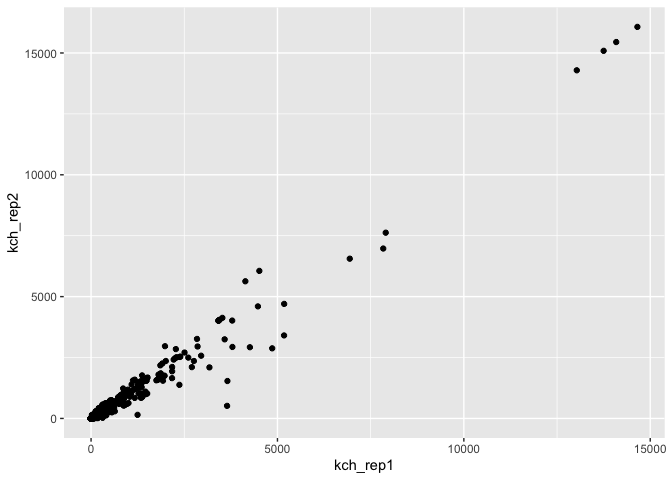
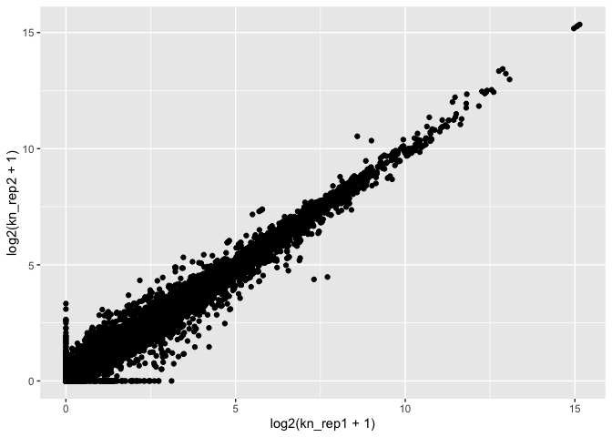
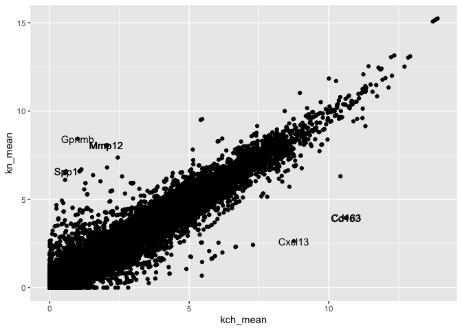
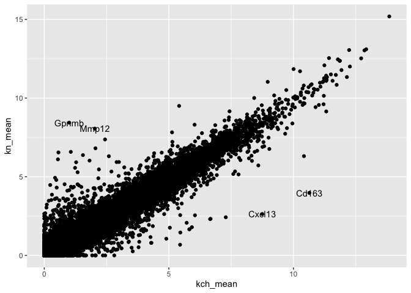
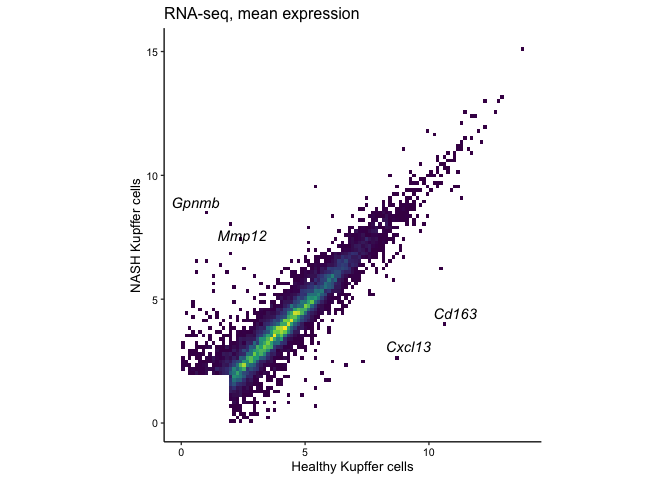

An introductory exploration of RNA-seq data using R and tidyverse
================
Ty D. Troutman
12/18/2021

## Some basics

Commenting your code can help you and others understand what you were
doing. A comment is generated using ‘\#’.

You can navigate your computer as follows:

``` r
# how to find your working directory
getwd()
```

    [1] "/Users/tro3nr/OneDrive - cchmc/Code/Github/Genomics-analyses/Vignettes"

``` r
# how to list directory files
list.files()
```

     [1] "Bar-Charts_files"                                
     [2] "Bar-Charts.md"                                   
     [3] "Bar-Charts.qmd"                                  
     [4] "Exporting-Gene-Lists.md"                         
     [5] "Exporting-Gene-Lists.qmd"                        
     [6] "Integrating-RNASeq-ExpressionTPM-with-DeSeq2.md" 
     [7] "Integrating-RNASeq-ExpressionTPM-with-DeSeq2.qmd"
     [8] "Introduction-RNASeqAnalysis.md"                  
     [9] "Introduction-RNASeqAnalysis.qmd"                 
    [10] "Introduction-RNASeqAnalysis.rmarkdown"           
    [11] "Nested-Bar-Charts_files"                         
    [12] "Nested-Bar-Charts.md"                            
    [13] "Nested-Bar-Charts.qmd"                           
    [14] "Processing RNA-seq data.md"                      
    [15] "Processing RNA-seq data.qmd"                     
    [16] "RNA-Seq_Mapping_TagDirs.qmd"                     

``` r
#how to list sub directories
list.dirs()
```

    [1] "."                                   
    [2] "./Bar-Charts_files"                  
    [3] "./Bar-Charts_files/figure-gfm"       
    [4] "./Nested-Bar-Charts_files"           
    [5] "./Nested-Bar-Charts_files/figure-gfm"

``` r
# how to list files from someplace other than your working directory
list.files("../Data/Source/")
```

     [1] "1-s2.0-S107476132030159X-mmc3.xlsx"                 
     [2] "BALBcJ_F0_Control.vs.C57BL6J_F0_Control.scatter.txt"
     [3] "BALBcJ_F1_Control.vs.C57BL6J_F1_Control.scatter.txt"
     [4] "C57BL6J_F0_Control.vs.BALBcJ_F0_Control.scatter.txt"
     [5] "C57BL6J_F1_Control.vs.BALBcJ_F1_Control.scatter.txt"
     [6] "deseq2_kc_control_lps_f0_f1.txt"                    
     [7] "HOMER.rawCount.txt"                                 
     [8] "HOMER.rawTPM.txt"                                   
     [9] "rawC.txt"                                           
    [10] "rawT.txt"                                           
    [11] "rnaSeq_tableS2_seidman_immunity_2020.csv"           

``` r
# how to make a new directory
# dir.create("~/Documents/example")

# how to change your working directory
# setwd("./")
```

## Reading in data

In this tutorial we will make a scatter plot using RNA-seq data from
table S2 in [Seidman et. al. Immunity. Volume 52, Issue 6, 16 June 2020,
Pages 1057-1074.e7](https://pubmed.ncbi.nlm.nih.gov/32362324/), which
can be downloaded
[here](https://ars.els-cdn.com/content/image/1-s2.0-S107476132030159X-mmc3.xlsx).
Once we have the data, we will need to open Rstudio and load the
necessary packages. We can do that with
[library()](https://www.datacamp.com/community/tutorials/r-packages-guide).

``` r
library(tidyverse)
```

    ── Attaching packages ─────────────────────────────────────── tidyverse 1.3.1 ──

    ✓ ggplot2 3.3.5     ✓ purrr   0.3.4
    ✓ tibble  3.1.6     ✓ dplyr   1.0.8
    ✓ tidyr   1.2.0     ✓ stringr 1.4.0
    ✓ readr   2.1.2     ✓ forcats 0.5.1

    Warning: package 'tidyr' was built under R version 4.1.2

    Warning: package 'readr' was built under R version 4.1.2

    ── Conflicts ────────────────────────────────────────── tidyverse_conflicts() ──
    x dplyr::filter() masks stats::filter()
    x dplyr::lag()    masks stats::lag()

Now we can use read_excel() from the
[readxl](https://readxl.tidyverse.org) package to load our excel
spreadsheet. We can use [readr:read_csv() or
readr:read_tsv()](https://readr.tidyverse.org) to load .csv and .txt
files.

``` r
# read in our data
tb1 <- 
  readxl::read_excel(
  path = "../Data/Source/1-s2.0-S107476132030159X-mmc3.xlsx") 
```

``` r
tb1
```

    # A tibble: 40,458 × 48
       `Transcript/RepeatID (cm…` `Annotation/Di…` `KCH_rep1_figu…` `KCH_rep2_figu…`
       <chr>                      <chr>                       <dbl>            <dbl>
     1 NM_001329047               Mia2|Ctage5|D12…            43.6             36.3 
     2 NM_172405                  Abraxas1|383040…             1.91             2.20
     3 NM_001359283               Sec63|5730478J1…            19.3             17.8 
     4 NM_001168290               Sugp2|Sfrs14|Sr…            11.5              8.86
     5 NM_001356498               Mtmr12|3Pap|493…             7.14             8.74
     6 NM_001358950               Cbx5|2610029O15…             6.53             6.21
     7 NM_001166375               March1|2900024D…            58.3             67.8 
     8 NM_178061                  Mob3b|8430436F2…             1.51             1.61
     9 NR_126506                  Mdm4|4933417N07…            29.2             25.6 
    10 NR_029557                  Mir145a|Mir145|…             0                0   
    # … with 40,448 more rows, and 44 more variables: `KCN_rep1_figure1,3,4` <dbl>,
    #   `KCN_rep2_figure1,3,4` <dbl>, `KN-RM_rep1_figure1,3,4` <dbl>,
    #   `KN-RM_rep2_figure1,3,4` <dbl>, `Ly6CHi-RM_rep1_figure1,3,4` <dbl>,
    #   `Ly6CHi-RM_rep2_figure1,3,4` <dbl>, `Ly6CLow-RM_rep1_figure1,3,4` <dbl>,
    #   `Ly6CLow-RM_rep2_figure1,3,4` <dbl>,
    #   `BloodLy6CHi-Mono_Control_rep1_figure3,4` <dbl>,
    #   `BloodLy6CHi-Mono_Control_rep2_figure3,4` <dbl>, …

We can use colnames() to see the names of the columns in this table.

``` r
colnames(x = tb1)
```

     [1] "Transcript/RepeatID (cmd=analyzeRepeats.pl rna mm10 -count exons -tpm -dfile Table_S2_dfile.txt)"
     [2] "Annotation/Divergence"                                                                           
     [3] "KCH_rep1_figure1,3,4"                                                                            
     [4] "KCH_rep2_figure1,3,4"                                                                            
     [5] "KCN_rep1_figure1,3,4"                                                                            
     [6] "KCN_rep2_figure1,3,4"                                                                            
     [7] "KN-RM_rep1_figure1,3,4"                                                                          
     [8] "KN-RM_rep2_figure1,3,4"                                                                          
     [9] "Ly6CHi-RM_rep1_figure1,3,4"                                                                      
    [10] "Ly6CHi-RM_rep2_figure1,3,4"                                                                      
    [11] "Ly6CLow-RM_rep1_figure1,3,4"                                                                     
    [12] "Ly6CLow-RM_rep2_figure1,3,4"                                                                     
    [13] "BloodLy6CHi-Mono_Control_rep1_figure3,4"                                                         
    [14] "BloodLy6CHi-Mono_Control_rep2_figure3,4"                                                         
    [15] "BloodLy6CHi-Mono_NASH_rep1_figure3,4"                                                            
    [16] "BloodLy6CHi-Mono_NASH_rep2_figure3,4"                                                            
    [17] "BloodLy6CHi-Mono_Control_rep3_figure3,4"                                                         
    [18] "BloodLy6CHi-Mono_Control_rep4_figure3,4"                                                         
    [19] "RLM_DT1D_rep1_figure3"                                                                           
    [20] "RLM_DT1D_rep2_figure3"                                                                           
    [21] "RLM_DT1D_rep3_figure3"                                                                           
    [22] "RLM_DT14D_rep1_figure3"                                                                          
    [23] "RLM_DT14D_rep2_figure3"                                                                          
    [24] "RLM_DT14D_rep3_figure3"                                                                          
    [25] "RLM_DT12H_rep1_figure3"                                                                          
    [26] "RLM_DT12H_rep2_figure3"                                                                          
    [27] "wholeLiver_DTRN_rep1_figure3"                                                                    
    [28] "wholeLiver_DTRN_rep2_figure3"                                                                    
    [29] "wholeLiver_DTRN_rep3_figure3"                                                                    
    [30] "wholeLiver_DTRN_rep4_figure3"                                                                    
    [31] "wholeLiver_DTRN_rep5_figure3"                                                                    
    [32] "wholeLiver_DTRN_rep6_figure3"                                                                    
    [33] "wholeLiver_DTRN_rep7_figure3"                                                                    
    [34] "wholeLiver_DTRN_rep8_figure3"                                                                    
    [35] "wholeLiver_DTRN_rep9_figure3"                                                                    
    [36] "wholeLiver_DTRN_rep10_figure3"                                                                   
    [37] "wholeLiver_DTRP_rep1_figure3"                                                                    
    [38] "wholeLiver_DTRP_rep2_figure3"                                                                    
    [39] "wholeLiver_DTRP_rep3_figure3"                                                                    
    [40] "wholeLiver_DTRP_rep4_figure3"                                                                    
    [41] "wholeLiver_DTRP_rep5_figure3"                                                                    
    [42] "wholeLiver_DTRP_rep6_figure3"                                                                    
    [43] "wholeLiver_DTRP_rep7_figure3"                                                                    
    [44] "wholeLiver_DTRP_rep8_figure3"                                                                    
    [45] "wholeLiver_DTRP_rep9_figure3"                                                                    
    [46] "wholeLiver_DTRP_rep10_figure3"                                                                   
    [47] "wholeLiver_DTRP_rep11_figure3"                                                                   
    [48] "wholeLiver_DTRP_rep12_figure3"                                                                   

That’s a lot of data, lets only keeps a small part that we want to
practice with for now. To do this let’s keep the first two columns,
which have gene identifier information, and lets keep the next 4 column
which are replicate RNA-seq data for two conditions. To keep these
columns, we will use the
[dplyr::select()](https://dplyr.tidyverse.org/reference/select.html)
verb, which operates on columns.

``` r
dplyr::select(.data = tb1, 1:6) # this format gives us column 1 to 6, and everything between
```

    # A tibble: 40,458 × 6
       `Transcript/RepeatID (cm…` `Annotation/Di…` `KCH_rep1_figu…` `KCH_rep2_figu…`
       <chr>                      <chr>                       <dbl>            <dbl>
     1 NM_001329047               Mia2|Ctage5|D12…            43.6             36.3 
     2 NM_172405                  Abraxas1|383040…             1.91             2.20
     3 NM_001359283               Sec63|5730478J1…            19.3             17.8 
     4 NM_001168290               Sugp2|Sfrs14|Sr…            11.5              8.86
     5 NM_001356498               Mtmr12|3Pap|493…             7.14             8.74
     6 NM_001358950               Cbx5|2610029O15…             6.53             6.21
     7 NM_001166375               March1|2900024D…            58.3             67.8 
     8 NM_178061                  Mob3b|8430436F2…             1.51             1.61
     9 NR_126506                  Mdm4|4933417N07…            29.2             25.6 
    10 NR_029557                  Mir145a|Mir145|…             0                0   
    # … with 40,448 more rows, and 2 more variables: `KCN_rep1_figure1,3,4` <dbl>,
    #   `KCN_rep2_figure1,3,4` <dbl>

``` r
dplyr::select(.data = tb1, c(1, 2, 3, 4, 5, 6)) # this format declares which columns to keep in order
```

    # A tibble: 40,458 × 6
       `Transcript/RepeatID (cm…` `Annotation/Di…` `KCH_rep1_figu…` `KCH_rep2_figu…`
       <chr>                      <chr>                       <dbl>            <dbl>
     1 NM_001329047               Mia2|Ctage5|D12…            43.6             36.3 
     2 NM_172405                  Abraxas1|383040…             1.91             2.20
     3 NM_001359283               Sec63|5730478J1…            19.3             17.8 
     4 NM_001168290               Sugp2|Sfrs14|Sr…            11.5              8.86
     5 NM_001356498               Mtmr12|3Pap|493…             7.14             8.74
     6 NM_001358950               Cbx5|2610029O15…             6.53             6.21
     7 NM_001166375               March1|2900024D…            58.3             67.8 
     8 NM_178061                  Mob3b|8430436F2…             1.51             1.61
     9 NR_126506                  Mdm4|4933417N07…            29.2             25.6 
    10 NR_029557                  Mir145a|Mir145|…             0                0   
    # … with 40,448 more rows, and 2 more variables: `KCN_rep1_figure1,3,4` <dbl>,
    #   `KCN_rep2_figure1,3,4` <dbl>

We can also pipe commands from left to right using magrittr
[%\>%](https://magrittr.tidyverse.org) operator. This allows us to chain
operations together so that we don’t need to define a bunch of variables
to store in memory, or overwrite variables by reusing variable names.
Reusing variable names can lead to bugs in our analyses (if we aren’t
careful)!

``` r
tb1 <- readxl::read_xlsx(
  path = "../Data/Source/1-s2.0-S107476132030159X-mmc3.xlsx") %>% 
  dplyr::select(1:6) 
tb1
```

    # A tibble: 40,458 × 6
       `Transcript/RepeatID (cm…` `Annotation/Di…` `KCH_rep1_figu…` `KCH_rep2_figu…`
       <chr>                      <chr>                       <dbl>            <dbl>
     1 NM_001329047               Mia2|Ctage5|D12…            43.6             36.3 
     2 NM_172405                  Abraxas1|383040…             1.91             2.20
     3 NM_001359283               Sec63|5730478J1…            19.3             17.8 
     4 NM_001168290               Sugp2|Sfrs14|Sr…            11.5              8.86
     5 NM_001356498               Mtmr12|3Pap|493…             7.14             8.74
     6 NM_001358950               Cbx5|2610029O15…             6.53             6.21
     7 NM_001166375               March1|2900024D…            58.3             67.8 
     8 NM_178061                  Mob3b|8430436F2…             1.51             1.61
     9 NR_126506                  Mdm4|4933417N07…            29.2             25.6 
    10 NR_029557                  Mir145a|Mir145|…             0                0   
    # … with 40,448 more rows, and 2 more variables: `KCN_rep1_figure1,3,4` <dbl>,
    #   `KCN_rep2_figure1,3,4` <dbl>

These column names could be made easier. Let’s rename them using the
dplyr verb
[dplyr::rename](https://dplyr.tidyverse.org/reference/rename.html?q=rename).

``` r
tb1 <- readxl::read_xlsx(
  path = "../Data/Source/1-s2.0-S107476132030159X-mmc3.xlsx") 
tb1 <- dplyr::select(tb1, 1:6)
tb1 <- rename(.data = tb1, accession = 1, gene = 2, kch_rep1 = 3, kch_rep2 = 4, kn_rep1 = 5, kn_rep2 = 6)
tb1
```

    # A tibble: 40,458 × 6
       accession    gene                           kch_rep1 kch_rep2 kn_rep1 kn_rep2
       <chr>        <chr>                             <dbl>    <dbl>   <dbl>   <dbl>
     1 NM_001329047 Mia2|Ctage5|D12Bwg0579e|Mea6|…    43.6     36.3   29.6    26.8  
     2 NM_172405    Abraxas1|3830405G04Rik|563040…     1.91     2.20   1.95    1.82 
     3 NM_001359283 Sec63|5730478J10Rik|AI649014|…    19.3     17.8   13.2    12.9  
     4 NM_001168290 Sugp2|Sfrs14|Srsf14|mKIAA0365…    11.5      8.86  10.9     7.57 
     5 NM_001356498 Mtmr12|3Pap|4932703C11|C73001…     7.14     8.74   6.71    6.84 
     6 NM_001358950 Cbx5|2610029O15Rik|C75991|HP1…     6.53     6.21   5.86    7.20 
     7 NM_001166375 March1|2900024D24Rik|BB085186…    58.3     67.8   49.4    50.2  
     8 NM_178061    Mob3b|8430436F23Rik|A430018A0…     1.51     1.61   0.729   0.906
     9 NR_126506    Mdm4|4933417N07Rik|AA414968|A…    29.2     25.6   16.4    13.3  
    10 NR_029557    Mir145a|Mir145|Mirn145|mir-14…     0        0      0       0    
    # … with 40,448 more rows

The above snippet is equivalent to using a string of pipes to parse the
data prior to generating the final variable:

``` r
tb1 <-
  readxl::read_xlsx(path = "../Data/Source/1-s2.0-S107476132030159X-mmc3.xlsx") %>%
  dplyr::select(1:6) %>%
  dplyr::rename(
    accession = 1,
    gene = 2,
    kch_rep1 = 3,
    kch_rep2 = 4,
    kn_rep1 = 5,
    kn_rep2 = 6
  )
tb1
```

    # A tibble: 40,458 × 6
       accession    gene                           kch_rep1 kch_rep2 kn_rep1 kn_rep2
       <chr>        <chr>                             <dbl>    <dbl>   <dbl>   <dbl>
     1 NM_001329047 Mia2|Ctage5|D12Bwg0579e|Mea6|…    43.6     36.3   29.6    26.8  
     2 NM_172405    Abraxas1|3830405G04Rik|563040…     1.91     2.20   1.95    1.82 
     3 NM_001359283 Sec63|5730478J10Rik|AI649014|…    19.3     17.8   13.2    12.9  
     4 NM_001168290 Sugp2|Sfrs14|Srsf14|mKIAA0365…    11.5      8.86  10.9     7.57 
     5 NM_001356498 Mtmr12|3Pap|4932703C11|C73001…     7.14     8.74   6.71    6.84 
     6 NM_001358950 Cbx5|2610029O15Rik|C75991|HP1…     6.53     6.21   5.86    7.20 
     7 NM_001166375 March1|2900024D24Rik|BB085186…    58.3     67.8   49.4    50.2  
     8 NM_178061    Mob3b|8430436F23Rik|A430018A0…     1.51     1.61   0.729   0.906
     9 NR_126506    Mdm4|4933417N07Rik|AA414968|A…    29.2     25.6   16.4    13.3  
    10 NR_029557    Mir145a|Mir145|Mirn145|mir-14…     0        0      0       0    
    # … with 40,448 more rows

## A Basic Scatter Plot

Now we have some tidy data, let’s compare the replicates by making a
scatterplot! We can accomplish this using
[ggplot2](https://ggplot2.tidyverse.org) and the
[geom_point()](https://ggplot2.tidyverse.org/reference/index.html) layer

Notice that we pipe our tidy data into ggplot2 as before with ‘%\>%’.
However, for assembling a ggplot script, we instead ‘add’ each component
together in series using the ‘+’. This happens after initiating the
ggplot() function call. After this point, we should for now think of the
data as no longer requiring manipulation using function outside of
ggplot context. *See [Hadley Wickham’s
answer](https://community.rstudio.com/t/why-cant-ggplot2-use/4372/6) for
a better understanding on why ggplot2 uses ‘+’ and not ‘%\>%’.*

``` r
tb1 %>% 
  ggplot() + # + not %>%
  geom_point(mapping = aes(x = kch_rep1,
                           y = kch_rep2))
```



This works, but we notice here that the RNA-seq data is not normally
distributed. Instead it is log normal. This means if we want to best
visualize a lot of genes at the same time, we should first transform
them. We accomplish this by adding 1 to each data point, then taking the
log base 2 of each data point: log2(dataExample + 1). This transform can
be easily wrapped into the ggplot code. To learn more about how to use R
to comput logarithms and exponents, click this
[link](https://www.rdocumentation.org/packages/base/versions/3.6.2/topics/log)
or type ‘?log()’ into the R console.

``` r
tb1 %>%
  ggplot() +
  geom_point(mapping = aes(x = log2(kch_rep1 + 1),
                           y = log2(kch_rep2 + 1)))
```


Do the same thing but with the other pair of data:

``` r
tb1 %>%
  ggplot() +
  geom_point(mapping = aes(x = log2(kn_rep1 + 1),
                           y = log2(kn_rep2 + 1)))
```



But now we want to compare the conditions to each other instead of
comparing the biological replicates. To do that we need to summarize the
data and compute the mean values. This is accomplished using
dplyr::mutate.

First read a little about
‘[mutate()](https://dplyr.tidyverse.org/reference/mutate.html)’ and
‘[across()](https://dplyr.tidyverse.org/reference/across.html)’. These
are powerful tools for data transforms, but require some practice. They
also require careful attention to the logic to ensure operations are
occurring as you desire.

``` r
?mutate()
?across()
```

Now lets calculate the within group means for our replicates. But before
we do that, we should remember we also need out data to be log2(data+1)
transformed.The challenge is we need to tell R that we want to transform
each cell from the columns we point it to. We can accomplish this by
using the vector function dplyr::across inside of mutate. There are many
useful strategies for processing data by combining the mutate verb and
across function.

``` r
tb1 %>%
  mutate(
    across(
      .cols = 3:6, # define the columns to mutate
      .fns = ~ log2(. + 1) # define the function, the '.' represents the data in each cell
    )
  )
```

    # A tibble: 40,458 × 6
       accession    gene                           kch_rep1 kch_rep2 kn_rep1 kn_rep2
       <chr>        <chr>                             <dbl>    <dbl>   <dbl>   <dbl>
     1 NM_001329047 Mia2|Ctage5|D12Bwg0579e|Mea6|…     5.48     5.22   4.94    4.80 
     2 NM_172405    Abraxas1|3830405G04Rik|563040…     1.54     1.68   1.56    1.49 
     3 NM_001359283 Sec63|5730478J10Rik|AI649014|…     4.34     4.23   3.83    3.79 
     4 NM_001168290 Sugp2|Sfrs14|Srsf14|mKIAA0365…     3.64     3.30   3.58    3.10 
     5 NM_001356498 Mtmr12|3Pap|4932703C11|C73001…     3.03     3.28   2.95    2.97 
     6 NM_001358950 Cbx5|2610029O15Rik|C75991|HP1…     2.91     2.85   2.78    3.04 
     7 NM_001166375 March1|2900024D24Rik|BB085186…     5.89     6.10   5.66    5.68 
     8 NM_178061    Mob3b|8430436F23Rik|A430018A0…     1.33     1.38   0.790   0.931
     9 NR_126506    Mdm4|4933417N07Rik|AA414968|A…     4.92     4.73   4.12    3.84 
    10 NR_029557    Mir145a|Mir145|Mirn145|mir-14…     0        0      0       0    
    # … with 40,448 more rows

Now pipe the log normalization into a mean calculation, again using
dplyr::mutate.

``` r
tb1 %>%
  mutate(
    across(
      .cols = 3:6, # define the columns to mutate
      .fns = ~ log2(. + 1) # define the function, the '.' represents the data in each cell
    )
  ) %>%
  mutate(
    kch_mean = (kch_rep1 + kch_rep2)/2,
    kn_mean = (kn_rep1 + kn_rep2)/2
  )
```

    # A tibble: 40,458 × 8
       accession    gene          kch_rep1 kch_rep2 kn_rep1 kn_rep2 kch_mean kn_mean
       <chr>        <chr>            <dbl>    <dbl>   <dbl>   <dbl>    <dbl>   <dbl>
     1 NM_001329047 Mia2|Ctage5|…     5.48     5.22   4.94    4.80      5.35   4.87 
     2 NM_172405    Abraxas1|383…     1.54     1.68   1.56    1.49      1.61   1.53 
     3 NM_001359283 Sec63|573047…     4.34     4.23   3.83    3.79      4.29   3.81 
     4 NM_001168290 Sugp2|Sfrs14…     3.64     3.30   3.58    3.10      3.47   3.34 
     5 NM_001356498 Mtmr12|3Pap|…     3.03     3.28   2.95    2.97      3.16   2.96 
     6 NM_001358950 Cbx5|2610029…     2.91     2.85   2.78    3.04      2.88   2.91 
     7 NM_001166375 March1|29000…     5.89     6.10   5.66    5.68      6.00   5.67 
     8 NM_178061    Mob3b|843043…     1.33     1.38   0.790   0.931     1.36   0.860
     9 NR_126506    Mdm4|4933417…     4.92     4.73   4.12    3.84      4.82   3.98 
    10 NR_029557    Mir145a|Mir1…     0        0      0       0         0      0    
    # … with 40,448 more rows

Now let’s check our code is working by independently computing a test
case. We can identify some test data by ‘slicing’ out a row using the
[dplyr::slice](https://dplyr.tidyverse.org/articles/base.html?q=slice#slice-choose-rows-by-position)
verb and selecting the columns to compute.

``` r
tb1 %>% slice(1) %>% select(3:4)
```

    # A tibble: 1 × 2
      kch_rep1 kch_rep2
         <dbl>    <dbl>
    1     43.6     36.3

Manually calculate the average:

``` r
(log2(43.6 + 1) + log2(36.3 + 1))/2
```

    [1] 5.350038

Does the value equal what we got above? What is different?

``` r
tb1 %>%
  mutate(
    across(
      .cols = 3:6, # define the columns to mutate
      .fns = ~ log2(. + 1) # define the function, the '.' represents the data in each cell
    )
  ) %>%
  mutate(
    kch_mean = (kch_rep1 + kch_rep2)/2,
    kn_mean = (kn_rep1 + kn_rep2)/2
  ) %>% slice(1) %>% select(7)
```

    # A tibble: 1 × 1
      kch_mean
         <dbl>
    1     5.35

Now lets add these components together and make the comparison scatter
plot. Remember that now we are plotting the newly created variable that
we generate within the piped commands. Thus we need to provide those
variable names to geom_point(). And since we already log transformed, we
should not do it again inside the ggplot code block. Note: here I am
stashing the transformed data as a new variable. I then use this new
variable to pipe into ggplot on a new coding line. We will use this
variable further below.

``` r
tb2 <- 
  tb1 %>%
  mutate(
    across(
      .cols = 3:6, # define the columns to mutate
      .fns = ~ log2(. + 1) # define the function, the '.' represents the data in each cell
    )
  ) %>%
  mutate(
    kch_mean = (kch_rep1 + kch_rep2)/2,
    kn_mean = (kn_rep1 + kn_rep2)/2
  )

tb2 %>%
  ggplot() +
  geom_point(aes(x = kch_mean, y = kn_mean))
```


Ok great, but now we really want to know the identity of the genes with
the largest differences! Let’s make a new variable with only those
genes. We normally accomplish this using differential expression
analysis. Today let’s use a simpler strategy by just comparing the
fold-change.

Remember, in [logarithmic
mathematics](https://en.wikipedia.org/wiki/Logarithm), log2(x+1) -
log2(y+1) is equal to log2((x+1) / (y+1)). Since our data is already log
transformed, the fold change is computer by comparing the difference of
the numbers.

``` r
tb2 %>% 
  mutate(
    logFC = kch_mean - kn_mean
  )
```

    # A tibble: 40,458 × 9
       accession    gene  kch_rep1 kch_rep2 kn_rep1 kn_rep2 kch_mean kn_mean   logFC
       <chr>        <chr>    <dbl>    <dbl>   <dbl>   <dbl>    <dbl>   <dbl>   <dbl>
     1 NM_001329047 Mia2…     5.48     5.22   4.94    4.80      5.35   4.87   0.483 
     2 NM_172405    Abra…     1.54     1.68   1.56    1.49      1.61   1.53   0.0830
     3 NM_001359283 Sec6…     4.34     4.23   3.83    3.79      4.29   3.81   0.474 
     4 NM_001168290 Sugp…     3.64     3.30   3.58    3.10      3.47   3.34   0.136 
     5 NM_001356498 Mtmr…     3.03     3.28   2.95    2.97      3.16   2.96   0.196 
     6 NM_001358950 Cbx5…     2.91     2.85   2.78    3.04      2.88   2.91  -0.0253
     7 NM_001166375 Marc…     5.89     6.10   5.66    5.68      6.00   5.67   0.330 
     8 NM_178061    Mob3…     1.33     1.38   0.790   0.931     1.36   0.860  0.496 
     9 NR_126506    Mdm4…     4.92     4.73   4.12    3.84      4.82   3.98   0.845 
    10 NR_029557    Mir1…     0        0      0       0         0      0      0     
    # … with 40,448 more rows

Ok, now lets identify the instance were the logFC is \> 1 or \< -1. In
other words, a fold change greater than ‘2’. For this we will use a new
dplyr verb,
[dplyr::filter](https://dplyr.tidyverse.org/reference/filter.html),
which operates on data rows. We also will need to use an R logical
operator. With R, ‘\|’ is equivalent to or, ‘&’ is equivalent to and.
Read more here: <https://www.statmethods.net/management/operators.html>

``` r
tb2 %>% 
  mutate(
    logFC = kch_mean - kn_mean
  ) %>%
  filter(logFC > 1 | logFC < -1)
```

    # A tibble: 1,757 × 9
       accession    gene    kch_rep1 kch_rep2 kn_rep1 kn_rep2 kch_mean kn_mean logFC
       <chr>        <chr>      <dbl>    <dbl>   <dbl>   <dbl>    <dbl>   <dbl> <dbl>
     1 NM_021334    Itgax|…    2.06     2.05     6.58    7.04    2.06     6.81 -4.75
     2 NM_001111059 Cd34|A…    0.579    0.573    2.06    1.86    0.576    1.96 -1.39
     3 NM_022995    Pmepa1…    0.864    1.06     1.89    2.61    0.961    2.25 -1.29
     4 NM_008433    Kcnn4|…    0.840    1.08     3.38    3.75    0.959    3.56 -2.60
     5 NM_001130458 Tcn2|A…    9.61     9.87     8.33    7.84    9.74     8.09  1.65
     6 NR_046233    Rn45s|…   10.9     11.1      8.59   10.5    11.0      9.56  1.46
     7 NM_010730    Anxa1|…    0.766    1.05     3.25    3.90    0.906    3.57 -2.67
     8 NR_122039    Tsc22d…    6.68     6.90     6.09    5.27    6.79     5.68  1.11
     9 NM_001361978 Arsg|6…    2.12     2.56     1.50    1.07    2.34     1.29  1.05
    10 NM_145134    Spsb4|…    0.327    0.842    3.03    3.39    0.584    3.21 -2.63
    # … with 1,747 more rows

This yields a lot of ‘different’ genes! Lets make our space smaller by
being more restrictive. Lets also generate a new variable with this
smaller data set.

``` r
tb3 <-
  tb2 %>% 
  mutate(
    logFC = kch_mean - kn_mean
  ) %>%
  filter(logFC > 6 | logFC < -6)
tb3
```

    # A tibble: 8 × 9
      accession    gene     kch_rep1 kch_rep2 kn_rep1 kn_rep2 kch_mean kn_mean logFC
      <chr>        <chr>       <dbl>    <dbl>   <dbl>   <dbl>    <dbl>   <dbl> <dbl>
    1 NM_053110    Gpnmb|D…    1.03     0.969    8.08    8.79    1.00     8.44 -7.44
    2 NM_018866    Cxcl13|…   10.3      7.21     3.80    1.46    8.75     2.63  6.12
    3 NM_008605    Mmp12|A…    1.88     2.18     8.02    8.10    2.03     8.06 -6.03
    4 NM_053094    Cd163|C…   10.6     10.7      4.85    3.10   10.6      3.97  6.67
    5 NM_001320076 Mmp12|A…    1.87     2.17     8.02    8.09    2.02     8.05 -6.04
    6 NM_001204203 Spp1|2A…    0.597    0.570    5.79    7.39    0.584    6.59 -6.00
    7 NM_009263    Spp1|2A…    0.598    0.571    5.78    7.39    0.585    6.59 -6.00
    8 NM_001170395 Cd163|C…   10.5     10.7      4.83    3.08   10.6      3.95  6.66

Ok, 8 genes is a small enough set for now. Now lets add labels to our
scatter plot above with the identifier information for these genes. We
can accomplish this in several ways. One way is to overlay the text from
the new filtered variable using
[geom_text()](https://ggplot2.tidyverse.org/articles/articles/faq-annotation.html?q=geom%20_%20text#why-is-annotation-created-with-geom_text-pixellated-how-can-i-make-it-more-crisp).
In this case we must define the source of the data and the x and y
positions must be the same. We also must supply the identity of the
column containing the labels.

``` r
tb2 %>% 
  ggplot() +
  geom_point(aes(x = kch_mean, y = kn_mean)) +
  geom_text(data = tb3, aes(x = kch_mean, y = kn_mean, label = accession))
```


Ok, that’s not bad, but a gene name would be better. Unfortunately, our
gene names are buried in with a lot of information. Let’s extract it!
That is made easy with columns using the
[tidyr::separate](https://tidyr.tidyverse.org/reference/separate.html)
verb. Read about it first:

``` r
?tidyr::separate()
```

``` r
tb3 <- 
  tb2 %>% 
  mutate(
    logFC = kch_mean - kn_mean
  ) %>%
  filter(logFC > 6 | logFC < -6) %>%
  separate(col = 2, into = "gene", 
           sep = "\\|", # this part is tricky and follow 'regular expression' rules
           remove = TRUE, extra = "drop")
```

Now lets regenerate the scatter plot with the gene names labeled
instead.

``` r
tb2 %>% 
  ggplot() +
  geom_point(aes(x = kch_mean, y = kn_mean)) +
  geom_text(data = tb3, aes(x = kch_mean, y = kn_mean, label = gene))
```



Pretty good, but those duplicate gene names from splice variant
accessions are cause the plot to look blurry. We can remove those
without much forethought using the
[dplyr::distinct](https://dplyr.tidyverse.org/reference/distinct.html)
verb. That’s not the best idea long term, but useful for now. I will
apply this to the initial data being plotted and also inside
geom_text().

``` r
?distinct()

tb2 %>%
  distinct(gene, .keep_all = TRUE) %>%
  ggplot() +
  geom_point(aes(x = kch_mean, y = kn_mean)) +
  geom_text(data = tb3 %>% distinct(gene, .keep_all = TRUE),
            aes(x = kch_mean, y = kn_mean, label = gene))
```


Now we can stack it all together. Into one tibble. And use that tibble
for our plot. Which also provides the opportunity to illustrate that
dplyr functions can be layered inside of gglot functions.

``` r
tb4 <-
  readxl::read_xlsx(path = "../Data/Source/1-s2.0-S107476132030159X-mmc3.xlsx") %>%
  dplyr::select(1:6) %>%
  dplyr::rename(
    accession = 1,
    gene = 2,
    kch_rep1 = 3,
    kch_rep2 = 4,
    kn_rep1 = 5,
    kn_rep2 = 6
  ) %>%
  separate(col = 2, into = "gene", 
           sep = "\\|", # this part is tricky and follow 'regular expression' rules
           remove = TRUE, extra = "drop") %>%
  distinct(gene, .keep_all = TRUE) %>%
  mutate(
    across(
      .cols = 3:6, # define the columns to mutate
      .fns = ~ log2(. + 1) # define the function, the '.' represents the data in each cell
    )
  ) %>%
  mutate(
    kch_mean = (kch_rep1 + kch_rep2)/2,
    kn_mean = (kn_rep1 + kn_rep2)/2
  ) %>% 
  mutate(
    logFC = kch_mean - kn_mean
  )
tb4
```

    # A tibble: 24,941 × 9
       accession    gene  kch_rep1 kch_rep2 kn_rep1 kn_rep2 kch_mean kn_mean   logFC
       <chr>        <chr>    <dbl>    <dbl>   <dbl>   <dbl>    <dbl>   <dbl>   <dbl>
     1 NM_001329047 Mia2      5.48     5.22   4.94    4.80      5.35   4.87   0.483 
     2 NM_172405    Abra…     1.54     1.68   1.56    1.49      1.61   1.53   0.0830
     3 NM_001359283 Sec63     4.34     4.23   3.83    3.79      4.29   3.81   0.474 
     4 NM_001168290 Sugp2     3.64     3.30   3.58    3.10      3.47   3.34   0.136 
     5 NM_001356498 Mtmr…     3.03     3.28   2.95    2.97      3.16   2.96   0.196 
     6 NM_001358950 Cbx5      2.91     2.85   2.78    3.04      2.88   2.91  -0.0253
     7 NM_001166375 Marc…     5.89     6.10   5.66    5.68      6.00   5.67   0.330 
     8 NM_178061    Mob3b     1.33     1.38   0.790   0.931     1.36   0.860  0.496 
     9 NR_126506    Mdm4      4.92     4.73   4.12    3.84      4.82   3.98   0.845 
    10 NR_029557    Mir1…     0        0      0       0         0      0      0     
    # … with 24,931 more rows

``` r
tb4 %>%
  ggplot() +
  geom_point(aes(x = kch_mean, y = kn_mean)) +
  geom_text(data = tb4 %>%
              filter(logFC > 6 | logFC < -6), 
            aes(x = kch_mean, y = kn_mean, label = gene))
```



Finally, we have a plot that we may want to share. This is easy with
ggplot using
[ggave()](https://ggplot2.tidyverse.org/reference/ggsave.html?q=ggsave).
We can either make the plot itself into a variable, or simply generate
an image using the last ggplot created.

``` r
plot1 <-
  tb4 %>%
  ggplot() +
  geom_point(aes(x = kch_mean, y = kn_mean)) +
  geom_text(data = tb4 %>%
              filter(logFC > 6 | logFC < -6),
            aes(x = kch_mean, y = kn_mean, label = gene))
ggsave(
  filename = "../Data/Plots/scatterchart1.png",
  plot = plot1,
  width = 4,
  height = 4,
  units = "in",
  dpi = 150,
  bg = "white"
)
```

The plot can be refined in many ways. And the text can be better
controlled using the [ggrepel
package](https://cran.r-project.org/web/packages/ggrepel/vignettes/ggrepel.html).
See what you can do!

``` r
require(ggrepel)
```

    Loading required package: ggrepel

``` r
tb4 %>%
  filter(kch_mean > 2 | kn_mean > 2) %>%
  ggplot() +
  geom_bin_2d(aes(x = kch_mean, y = kn_mean), bins = 101) +
  scale_fill_continuous(type = "viridis") +
  geom_text_repel(
    data = tb4 %>%
      filter(logFC > 6 | logFC < -6),
    aes(x = kch_mean, y = kn_mean, label = gene),
    fontface = "italic"
  ) +
  theme_classic(base_size = 10) +
  theme(legend.position = "none", 
        axis.text = element_text(colour = "black")) +
  labs(x = "Healthy Kupffer cells", 
       y = "NASH Kupffer cells", 
       title = "RNA-seq, mean expression") +
  coord_fixed()
```



``` r
ggsave(
  filename = "../Data/Plots/scatterchart2.png",
  width = 4,
  height = 4,
  units = "in",
  dpi = 150,
  bg = "white"
)
```

## Finished!!

``` r
sessioninfo::session_info(pkgs = NULL) %>% details::details(summary = 'Current session info', open = TRUE)
```

<details open>
<summary>
<span title="Click to Expand"> Current session info </span>
</summary>

``` r

─ Session info ───────────────────────────────────────────────────────────────
 setting  value
 version  R version 4.1.0 (2021-05-18)
 os       macOS Big Sur 10.16
 system   x86_64, darwin17.0
 ui       X11
 language (EN)
 collate  en_US.UTF-8
 ctype    en_US.UTF-8
 tz       America/New_York
 date     2022-05-02
 pandoc   2.17.1.1 @ /Applications/RStudio.app/Contents/MacOS/quarto/bin/ (via rmarkdown)

─ Packages ───────────────────────────────────────────────────────────────────
 package     * version date (UTC) lib source
 assertthat    0.2.1   2019-03-21 [2] CRAN (R 4.1.0)
 backports     1.4.1   2021-12-13 [2] CRAN (R 4.1.0)
 broom         0.7.12  2022-01-28 [2] CRAN (R 4.1.2)
 cellranger    1.1.0   2016-07-27 [2] CRAN (R 4.1.0)
 cli           3.1.1   2022-01-20 [1] CRAN (R 4.1.2)
 clipr         0.7.1   2020-10-08 [2] CRAN (R 4.1.0)
 colorspace    2.0-2   2021-06-24 [2] CRAN (R 4.1.0)
 crayon        1.4.2   2021-10-29 [2] CRAN (R 4.1.0)
 DBI           1.1.2   2021-12-20 [2] CRAN (R 4.1.0)
 dbplyr        2.1.1   2021-04-06 [2] CRAN (R 4.1.0)
 desc          1.4.0   2021-09-28 [1] CRAN (R 4.1.0)
 details       0.2.1   2020-01-12 [2] CRAN (R 4.1.0)
 digest        0.6.29  2021-12-01 [2] CRAN (R 4.1.0)
 dplyr       * 1.0.8   2022-02-08 [2] CRAN (R 4.1.0)
 ellipsis      0.3.2   2021-04-29 [2] CRAN (R 4.1.0)
 evaluate      0.14    2019-05-28 [2] CRAN (R 4.1.0)
 fansi         1.0.2   2022-01-14 [2] CRAN (R 4.1.2)
 farver        2.1.0   2021-02-28 [2] CRAN (R 4.1.0)
 fastmap       1.1.0   2021-01-25 [1] CRAN (R 4.1.0)
 forcats     * 0.5.1   2021-01-27 [2] CRAN (R 4.1.0)
 fs            1.5.2   2021-12-08 [2] CRAN (R 4.1.0)
 generics      0.1.2   2022-01-31 [2] CRAN (R 4.1.2)
 ggplot2     * 3.3.5   2021-06-25 [2] CRAN (R 4.1.0)
 ggrepel     * 0.9.1   2021-01-15 [1] CRAN (R 4.1.0)
 glue          1.6.1   2022-01-22 [2] CRAN (R 4.1.2)
 gtable        0.3.0   2019-03-25 [2] CRAN (R 4.1.0)
 haven         2.4.3   2021-08-04 [1] CRAN (R 4.1.0)
 hms           1.1.1   2021-09-26 [2] CRAN (R 4.1.0)
 htmltools     0.5.2   2021-08-25 [2] CRAN (R 4.1.0)
 httr          1.4.2   2020-07-20 [2] CRAN (R 4.1.0)
 jsonlite      1.7.3   2022-01-17 [2] CRAN (R 4.1.2)
 knitr         1.37    2021-12-16 [2] CRAN (R 4.1.0)
 labeling      0.4.2   2020-10-20 [2] CRAN (R 4.1.0)
 lifecycle     1.0.1   2021-09-24 [2] CRAN (R 4.1.0)
 lubridate     1.8.0   2021-10-07 [2] CRAN (R 4.1.0)
 magrittr      2.0.2   2022-01-26 [2] CRAN (R 4.1.2)
 modelr        0.1.8   2020-05-19 [2] CRAN (R 4.1.0)
 munsell       0.5.0   2018-06-12 [2] CRAN (R 4.1.0)
 pillar        1.7.0   2022-02-01 [2] CRAN (R 4.1.2)
 pkgconfig     2.0.3   2019-09-22 [2] CRAN (R 4.1.0)
 png           0.1-7   2013-12-03 [2] CRAN (R 4.1.0)
 purrr       * 0.3.4   2020-04-17 [2] CRAN (R 4.1.0)
 R6            2.5.1   2021-08-19 [2] CRAN (R 4.1.0)
 ragg          1.1.3   2021-06-09 [2] CRAN (R 4.1.0)
 Rcpp          1.0.8   2022-01-13 [2] CRAN (R 4.1.2)
 readr       * 2.1.2   2022-01-30 [1] CRAN (R 4.1.2)
 readxl        1.3.1   2019-03-13 [2] CRAN (R 4.1.0)
 reprex        2.0.1   2021-08-05 [2] CRAN (R 4.1.0)
 rlang         1.0.1   2022-02-03 [2] CRAN (R 4.1.2)
 rmarkdown     2.11    2021-09-14 [1] CRAN (R 4.1.0)
 rprojroot     2.0.2   2020-11-15 [1] CRAN (R 4.1.0)
 rstudioapi    0.13    2020-11-12 [2] CRAN (R 4.1.0)
 rvest         1.0.2   2021-10-16 [2] CRAN (R 4.1.0)
 scales        1.1.1   2020-05-11 [2] CRAN (R 4.1.0)
 sessioninfo   1.2.2   2021-12-06 [1] CRAN (R 4.1.0)
 stringi       1.7.6   2021-11-29 [2] CRAN (R 4.1.0)
 stringr     * 1.4.0   2019-02-10 [2] CRAN (R 4.1.0)
 systemfonts   1.0.2   2021-05-11 [2] CRAN (R 4.1.0)
 textshaping   0.3.6   2021-10-13 [2] CRAN (R 4.1.0)
 tibble      * 3.1.6   2021-11-07 [2] CRAN (R 4.1.0)
 tidyr       * 1.2.0   2022-02-01 [2] CRAN (R 4.1.2)
 tidyselect    1.1.1   2021-04-30 [2] CRAN (R 4.1.0)
 tidyverse   * 1.3.1   2021-04-15 [1] CRAN (R 4.1.0)
 tzdb          0.2.0   2021-10-27 [2] CRAN (R 4.1.0)
 utf8          1.2.2   2021-07-24 [2] CRAN (R 4.1.0)
 vctrs         0.3.8   2021-04-29 [2] CRAN (R 4.1.0)
 viridisLite   0.4.0   2021-04-13 [2] CRAN (R 4.1.0)
 withr         2.4.3   2021-11-30 [1] CRAN (R 4.1.0)
 xfun          0.29    2021-12-14 [1] CRAN (R 4.1.0)
 xml2          1.3.3   2021-11-30 [2] CRAN (R 4.1.0)
 yaml          2.2.2   2022-01-25 [2] CRAN (R 4.1.2)

 [1] /Users/tro3nr/Library/R/x86_64/4.1/library
 [2] /Library/Frameworks/R.framework/Versions/4.1/Resources/library

──────────────────────────────────────────────────────────────────────────────
```

</details>

<br>
