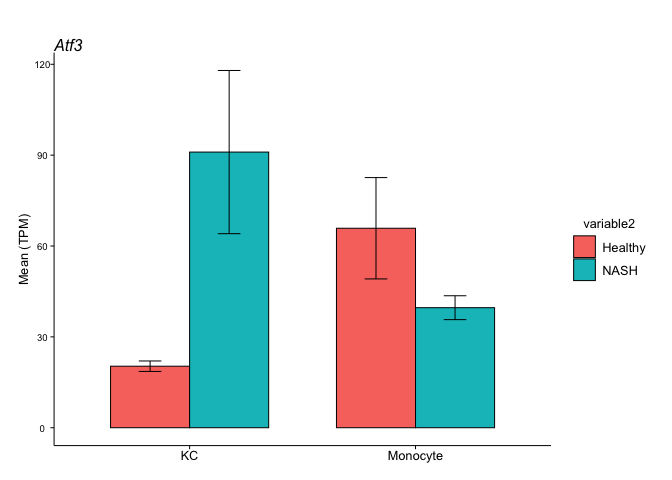

Saving bar charts from a nested list
================

Sometimes it is useful to generate individual bar chart files (or other
plots) instead of a facet plot. For this case I use a function to
intersect a character list of genes of interest (GOI) with HOMER RNA-seq
TPM data. Data is grouped via specified variable(s) and summary
statistics are calculated. Data is then grouped by GOI and nested into a
list. Finally, bar plots are iterated with purrr::map2() per GOI using
calculated summary statistics.

This function can be downloaded
[here](%22https://drive.google.com/file/d/14pVjzlYbI1PIC4XpTBkT8JZTlvfdvwkF/view?usp=sharing%22).

``` r
suppressMessages(library(tidyverse))
```

    Warning: package 'tidyr' was built under R version 4.1.2

    Warning: package 'readr' was built under R version 4.1.2

``` r
source("../Code/nestedBarCharts.R")
nestedBarCharts
```

    function (data, geneList, variable1, variable2, replicateID, 
        pointSize, lineWidth) 
    {
        .pointSize <- pointSize
        .lineWidth <- lineWidth/2.835
        theme_set(theme(text = element_text(size = .pointSize, colour = "black"), 
            line = element_line(size = .lineWidth/2.835, colour = "black"), 
            rect = element_rect(size = .lineWidth/2.835), axis.ticks.x = element_line(size = .lineWidth, 
                colour = "black"), axis.ticks.y = element_line(size = .lineWidth, 
                colour = "black"), axis.text.x = element_text(size = .pointSize * 
                0.8, colour = "black"), axis.text.y = element_text(size = .pointSize * 
                0.6, colour = "black"), axis.title = element_text(size = .pointSize * 
                0.8, colour = "black"), plot.title = element_text(hjust = 0, 
                face = "italic"), plot.subtitle = element_text(hjust = 0), 
            legend.position = "right", legend.title = element_text(size = .pointSize * 
                0.8, colour = "black"), legend.key = element_blank(), 
            legend.background = element_blank(), legend.text = element_text(size = .pointSize * 
                0.8, colour = "black"), panel.grid.major = element_blank(), 
            panel.grid.minor = element_blank(), panel.background = element_blank(), 
            panel.border = element_blank(), axis.line = element_line(size = .lineWidth, 
                colour = "black"), plot.margin = unit(c(1, 0.5, 0.5, 
                0.5), "cm"), strip.text = element_text(face = "italic", 
                size = .pointSize, hjust = 0), strip.placement = "outside", 
            strip.background = element_blank()))
        summarizedData <- data %>% rename(Gene = "Annotation/Divergence") %>% 
            filter(., Gene %in% goi) %>% pivot_longer(cols = -1, 
            names_to = c({
                {
                    variable1
                }
            }, {
                {
                    variable2
                }
            }, {
                {
                    replicateID
                }
            }), names_pattern = "(.*)_(.*)_(.*)", values_to = "TPM") %>% 
            group_by(Gene, .data[[variable1]], .data[[variable2]]) %>% 
            summarise(n = n(), mean = mean(TPM), sd = sd(TPM))
        nested_data <- summarizedData %>% group_by(Gene) %>% nest()
        nested_plots <- nested_data %>% mutate(plot = map2(data, 
            Gene, ~ggplot(data = .x, aes(x = .data[[variable1]], 
                y = mean, fill = .data[[variable2]])) + geom_bar(position = position_dodge(), 
                stat = "identity", colour = "black", size = .lineWidth, 
                width = 0.7) + geom_errorbar(aes(ymin = mean - sd, 
                ymax = mean + sd), colour = "black", size = .lineWidth, 
                width = 0.2, position = position_dodge(0.7)) + expand_limits(y = 0) + 
                theme(panel.spacing = unit(1, "lines")) + labs(title = Gene, 
                x = NULL, y = c("Mean (TPM)"))))
    }

We will use data from from table S2 in [Seidman et. al. Immunity. Volume
52, Issue 6, 16 June 2020, Pages
1057-1074.e7](https://pubmed.ncbi.nlm.nih.gov/32362324/) again to
demonstrate usage of the function. It can be downloaded
[here](https://ars.els-cdn.com/content/image/1-s2.0-S107476132030159X-mmc3.xlsx).

``` r
seidman_etal <-
  read_csv("../Data/Source/rnaSeq_tableS2_seidman_immunity_2020.csv",
           col_types = cols()) 
seidman_etal %>% select(1:6, 13:16) %>% colnames
```

     [1] "Transcript/RepeatID (cmd=analyzeRepeats.pl rna mm10 -count exons -tpm -dfile Table_S2_dfile.txt)"
     [2] "Annotation/Divergence"                                                                           
     [3] "KCH_rep1_figure1,3,4"                                                                            
     [4] "KCH_rep2_figure1,3,4"                                                                            
     [5] "KCN_rep1_figure1,3,4"                                                                            
     [6] "KCN_rep2_figure1,3,4"                                                                            
     [7] "BloodLy6CHi-Mono_Control_rep1_figure3,4"                                                         
     [8] "BloodLy6CHi-Mono_Control_rep2_figure3,4"                                                         
     [9] "BloodLy6CHi-Mono_NASH_rep1_figure3,4"                                                            
    [10] "BloodLy6CHi-Mono_NASH_rep2_figure3,4"                                                            

The *nestedBarCharts* function intersects the gene name from the
“Annotation/Divergence” column with a user generated list of genes of
interest. The function also requires replicate data with two grouping
variables. Each data column should be named with in order with a primary
grouping variable, a secondary grouping variable, and a replicate ID.
Each of these variables should be separated by an `_`. As an example:

**primaryGroup_secondaryGroup_replicate1**

With this in mind, tidy up the data and rename the columns. Then
generate a list of genes of interest.

``` r
tpmData <-
  seidman_etal %>%
  separate(
    col = "Annotation/Divergence",
    into = "Annotation/Divergence",
    sep = "\\|",
    remove = TRUE,
    extra = "drop"
  ) %>%
  select(2:6, 13:16) %>%
  rename(
    "KC_Healthy_rep1" = 2,
    "KC_Healthy_rep2" = 3,
    "KC_NASH_rep1" = 4,
    "KC_NASH_rep2" = 5,
    "Monocyte_Healthy_rep1" = 6,
    "Monocyte_Healthy_rep2" = 7,
    "Monocyte_NASH_rep1" = 8,
    "Monocyte_NASH_rep2" = 9
  )

goi <- c("Ccr2", "Atf3", "Trem2", "Cx3cr1")
```

Function usage: summary data and ggplot data are added to a user
delcared variable, which I call output here. It can then be printed to
an individual file per GOI as described below:

``` r
output <-
  tpmData %>%
  nestedBarCharts(
    geneList = "geneList",
    variable1 = "variable1",
    variable2 = "variable2",
    replicateID = "replicateID",
    pointSize = 12,
    lineWidth = 1
  )
```

    `summarise()` has grouped output by 'Gene', 'variable1'. You can override using
    the `.groups` argument.

``` r
output
```

    # A tibble: 4 × 3
    # Groups:   Gene [4]
      Gene   data             plot  
      <chr>  <list>           <list>
    1 Atf3   <tibble [4 × 5]> <gg>  
    2 Ccr2   <tibble [4 × 5]> <gg>  
    3 Cx3cr1 <tibble [4 × 5]> <gg>  
    4 Trem2  <tibble [4 × 5]> <gg>  

``` r
print(output$data[1])
```

    [[1]]
    # A tibble: 4 × 5
      variable1 variable2     n  mean    sd
      <chr>     <chr>     <int> <dbl> <dbl>
    1 KC        Healthy       2  20.3  1.73
    2 KC        NASH          2  91.0 26.9 
    3 Monocyte  Healthy       2  65.9 16.7 
    4 Monocyte  NASH          2  39.6  3.94

``` r
print(output$plot[1])
```

    [[1]]



The resulting list of ggplots can then be written to images of your
specification. First, generate a list of file names corresponding to
each row.

``` r
plotnames <-
  map(output$Gene, ~ paste0("../Data/Plots/nestedbarchart_", .x, ".png")) %>%
  flatten()
plotnames
```

    [[1]]
    [1] "../Data/Plots/nestedbarchart_Atf3.png"

    [[2]]
    [1] "../Data/Plots/nestedbarchart_Ccr2.png"

    [[3]]
    [1] "../Data/Plots/nestedbarchart_Cx3cr1.png"

    [[4]]
    [1] "../Data/Plots/nestedbarchart_Trem2.png"

Then write the plots to the disk using the file name list in ‘plotnames’
created above, and the ggplot object list in output\$plot. We can do
this in an iterative fashion using purrr::map2 or purrr::walk2.

``` r
walk2(plotnames,
      output$plot,
      ~ ggsave(
        filename = .x,
        plot = .y,
        height = 7,
        width = 7
      ))

# map_chr(
#   unlist(plotnames), ~ list.files(pattern = .x)
# )
```

Credit:
<https://aosmith.rbind.io/2018/08/20/automating-exploratory-plots/>
Credit:
<https://www.painblogr.org/2020-06-19-purring-through-exploratory-analyses.html>

## Finished!

``` r
sessioninfo::session_info(pkgs = NULL) %>% details::details(summary = 'Current session info', open = TRUE)
```

<details open>
<summary>
<span title="Click to Expand"> Current session info </span>
</summary>

``` r

─ Session info ───────────────────────────────────────────────────────────────
 setting  value
 version  R version 4.1.0 (2021-05-18)
 os       macOS Big Sur 10.16
 system   x86_64, darwin17.0
 ui       X11
 language (EN)
 collate  en_US.UTF-8
 ctype    en_US.UTF-8
 tz       America/New_York
 date     2022-05-02
 pandoc   2.17.1.1 @ /Applications/RStudio.app/Contents/MacOS/quarto/bin/ (via rmarkdown)

─ Packages ───────────────────────────────────────────────────────────────────
 package     * version date (UTC) lib source
 assertthat    0.2.1   2019-03-21 [2] CRAN (R 4.1.0)
 backports     1.4.1   2021-12-13 [2] CRAN (R 4.1.0)
 bit           4.0.4   2020-08-04 [1] CRAN (R 4.1.0)
 bit64         4.0.5   2020-08-30 [1] CRAN (R 4.1.0)
 broom         0.7.12  2022-01-28 [2] CRAN (R 4.1.2)
 cellranger    1.1.0   2016-07-27 [2] CRAN (R 4.1.0)
 cli           3.1.1   2022-01-20 [1] CRAN (R 4.1.2)
 clipr         0.7.1   2020-10-08 [2] CRAN (R 4.1.0)
 colorspace    2.0-2   2021-06-24 [2] CRAN (R 4.1.0)
 crayon        1.4.2   2021-10-29 [2] CRAN (R 4.1.0)
 DBI           1.1.2   2021-12-20 [2] CRAN (R 4.1.0)
 dbplyr        2.1.1   2021-04-06 [2] CRAN (R 4.1.0)
 desc          1.4.0   2021-09-28 [1] CRAN (R 4.1.0)
 details       0.2.1   2020-01-12 [2] CRAN (R 4.1.0)
 digest        0.6.29  2021-12-01 [2] CRAN (R 4.1.0)
 dplyr       * 1.0.8   2022-02-08 [2] CRAN (R 4.1.0)
 ellipsis      0.3.2   2021-04-29 [2] CRAN (R 4.1.0)
 evaluate      0.14    2019-05-28 [2] CRAN (R 4.1.0)
 fansi         1.0.2   2022-01-14 [2] CRAN (R 4.1.2)
 farver        2.1.0   2021-02-28 [2] CRAN (R 4.1.0)
 fastmap       1.1.0   2021-01-25 [1] CRAN (R 4.1.0)
 forcats     * 0.5.1   2021-01-27 [2] CRAN (R 4.1.0)
 fs            1.5.2   2021-12-08 [2] CRAN (R 4.1.0)
 generics      0.1.2   2022-01-31 [2] CRAN (R 4.1.2)
 ggplot2     * 3.3.5   2021-06-25 [2] CRAN (R 4.1.0)
 glue          1.6.1   2022-01-22 [2] CRAN (R 4.1.2)
 gtable        0.3.0   2019-03-25 [2] CRAN (R 4.1.0)
 haven         2.4.3   2021-08-04 [1] CRAN (R 4.1.0)
 hms           1.1.1   2021-09-26 [2] CRAN (R 4.1.0)
 htmltools     0.5.2   2021-08-25 [2] CRAN (R 4.1.0)
 httr          1.4.2   2020-07-20 [2] CRAN (R 4.1.0)
 jsonlite      1.7.3   2022-01-17 [2] CRAN (R 4.1.2)
 knitr         1.37    2021-12-16 [2] CRAN (R 4.1.0)
 labeling      0.4.2   2020-10-20 [2] CRAN (R 4.1.0)
 lifecycle     1.0.1   2021-09-24 [2] CRAN (R 4.1.0)
 lubridate     1.8.0   2021-10-07 [2] CRAN (R 4.1.0)
 magrittr      2.0.2   2022-01-26 [2] CRAN (R 4.1.2)
 modelr        0.1.8   2020-05-19 [2] CRAN (R 4.1.0)
 munsell       0.5.0   2018-06-12 [2] CRAN (R 4.1.0)
 pillar        1.7.0   2022-02-01 [2] CRAN (R 4.1.2)
 pkgconfig     2.0.3   2019-09-22 [2] CRAN (R 4.1.0)
 png           0.1-7   2013-12-03 [2] CRAN (R 4.1.0)
 purrr       * 0.3.4   2020-04-17 [2] CRAN (R 4.1.0)
 R6            2.5.1   2021-08-19 [2] CRAN (R 4.1.0)
 ragg          1.1.3   2021-06-09 [2] CRAN (R 4.1.0)
 Rcpp          1.0.8   2022-01-13 [2] CRAN (R 4.1.2)
 readr       * 2.1.2   2022-01-30 [1] CRAN (R 4.1.2)
 readxl        1.3.1   2019-03-13 [2] CRAN (R 4.1.0)
 reprex        2.0.1   2021-08-05 [2] CRAN (R 4.1.0)
 rlang         1.0.1   2022-02-03 [2] CRAN (R 4.1.2)
 rmarkdown     2.11    2021-09-14 [1] CRAN (R 4.1.0)
 rprojroot     2.0.2   2020-11-15 [1] CRAN (R 4.1.0)
 rstudioapi    0.13    2020-11-12 [2] CRAN (R 4.1.0)
 rvest         1.0.2   2021-10-16 [2] CRAN (R 4.1.0)
 scales        1.1.1   2020-05-11 [2] CRAN (R 4.1.0)
 sessioninfo   1.2.2   2021-12-06 [1] CRAN (R 4.1.0)
 stringi       1.7.6   2021-11-29 [2] CRAN (R 4.1.0)
 stringr     * 1.4.0   2019-02-10 [2] CRAN (R 4.1.0)
 systemfonts   1.0.2   2021-05-11 [2] CRAN (R 4.1.0)
 textshaping   0.3.6   2021-10-13 [2] CRAN (R 4.1.0)
 tibble      * 3.1.6   2021-11-07 [2] CRAN (R 4.1.0)
 tidyr       * 1.2.0   2022-02-01 [2] CRAN (R 4.1.2)
 tidyselect    1.1.1   2021-04-30 [2] CRAN (R 4.1.0)
 tidyverse   * 1.3.1   2021-04-15 [1] CRAN (R 4.1.0)
 tzdb          0.2.0   2021-10-27 [2] CRAN (R 4.1.0)
 utf8          1.2.2   2021-07-24 [2] CRAN (R 4.1.0)
 vctrs         0.3.8   2021-04-29 [2] CRAN (R 4.1.0)
 vroom         1.5.7   2021-11-30 [1] CRAN (R 4.1.0)
 withr         2.4.3   2021-11-30 [1] CRAN (R 4.1.0)
 xfun          0.29    2021-12-14 [1] CRAN (R 4.1.0)
 xml2          1.3.3   2021-11-30 [2] CRAN (R 4.1.0)
 yaml          2.2.2   2022-01-25 [2] CRAN (R 4.1.2)

 [1] /Users/tro3nr/Library/R/x86_64/4.1/library
 [2] /Library/Frameworks/R.framework/Versions/4.1/Resources/library

──────────────────────────────────────────────────────────────────────────────
```

</details>

<br>
